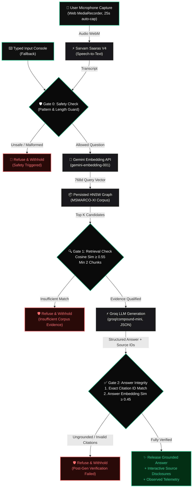

# Vaani — Multilingual Voice-to-Answer RAG System                                                          
> **"Evidence before eloquence."** — A voice-first Retrieval-Augmented Generation (RAG) system with active grounding gates, live pipeline observability, and verifiable source provenance.                               

[](./)                      
[](./)              
[](./)                            
[](./)
[](./)
[](./)
[](./)
[](#)

live :- https://vaani-rag.onrender.com            
---

## 📌 Overview

**Vaani** is a real-time, voice-first Retrieval-Augmented Generation system designed for multilingual Indian language retrieval (Hindi, Marathi, Tamil, Telugu, and English). Unlike conversational voice bots that prioritize fluent output over accuracy, Vaani enforces **strict citation adherence and dual-gate grounding** — every generated response is verifiable and physically tied to its retrieved source documents, or withheld by design.

---

## 🎯 The Problem & Our Approach               
        
### The Problem
1. **Hallucination in Voice AI:** Standard conversational voice systems attempt to answer every query even when they have no contextual grounding, producing convincing but fabricated answers.
2. **Invisible Pipelines:** Users have zero visibility into what stage failed, what passages were retrieved, or how long external APIs took.
3. **Multilingual Disconnect:** Most RAG setups fail on non-English inputs due to naive chunking and English-centric embedding models.
4. **Latency vs. Honesty:** Many systems claim unrealistic sub-200ms latency while silently mocking queries or bypassing grounding checks.

### Our Solution
* **Zero Fabricated Previews:** The answer panel remains deliberately empty until live evidence is retrieved and verified.
* **Dual Grounding Gates:**
  1. *Pre-Generation Retrieval Gate:* Blocks generation if retrieved passages do not meet a minimum cosine similarity threshold ($\ge 0.55$).
  2. *Post-Generation Verification Gate:* Verifies exact citation IDs in the structured JSON and confirms semantic support between the answer vector and cited passages ($\ge 0.45$).
* **Honest Telemetry:** Real-time P50, P70, and P100 latency telemetry calculated from real, executed pipeline runs.
* **Multi-Strategy Chunking:** Indexed across semantic sections, overlapping sliding windows, and short document views with full source provenance.

---

## 🏛️ System Architecture & Workflow



---

## 🛠️ Pipeline Stages

| Stage | Component / Provider | Purpose | Guardrail / Boundary |
|---|---|---|---|
| **01. Listening** | Native `MediaRecorder` + Web Audio API | Live browser amplitude visualization & audio capture | Capped at 25s to prevent STT timeouts |
| **02. Transcribing** | **Sarvam Saaras V4** (`api.sarvam.ai`) | Multilingual speech-to-text with auto-language detection | Handled network retries & structured error payloads |
| **03. Embedding** | **Google Gemini** (`gemini-embedding-001`) | Generates dense vectors for query and candidate verification | Bounded retries on rate limits; zero local mock |
| **04. Retrieving** | **HNSW Index** (`hnswlib-node`) | Approximate nearest neighbors over MSMARCO-XI splits | Cosine similarity thresholding ($\ge 0.55$, $\ge 2$ chunks) |
| **05. Generating** | **Groq Cloud** (`groq/compound-mini`) | Structured JSON generation containing answer and citations | Enforced `json_object` schema, temperature 0 |
| **06. Integrity Gate** | `guardrails.ts` | Citation ID validation & reverse semantic support check | Blocks answers failing citation or semantic parity ($\ge 0.45$) |

---

## 🔬 Key Engineering Challenges & Solutions

### 1. The Missing Guardrails & Gating Architecture
* **Problem:** Pipeline imports required strict verification functions (`safetyCheck`, `retrievalCheck`, `citationCheck`, `semanticSupportCheck`) to protect against hallucinations and off-topic queries.
* **Fix:** Implemented [`guardrails.ts`](./guardrails.ts) with mathematical similarity cutoffs and citation sets. Queries outside the MSMARCO-XI index (e.g. general weather, live sports) are gracefully refused with explicit explanations.

### 2. Migration to Hosted Gemini Embeddings
* **Problem:** Earlier iterations used local/remote endpoints that introduced tunnel instability and required heavy local GPU runtimes.
* **Fix:** Standardized on `gemini-embedding-001` via the official Google REST API with server-only key isolation, reducing cold-start times and providing consistent vector dimensions for multilingual retrieval.

### 3. Microphone Capture & Synchronous STT Thresholds
* **Problem:** Long recordings caused Sarvam's synchronous 30s endpoint to time out and degrade UX.
* **Fix:** Added an automatic 25-second UI countdown limit in `Home.tsx` that stops recording cleanly and notifies the user before initiating transcription.

### 4. Strict Design Alignment (Neuform Nexus AI)
* **Problem:** Color drift in UI tokens (`#40e79a` vs `#34D399`).
* **Fix:** Standardized all styling tokens in [`index.css`](./index.css) to strictly mirror `nexus-ai-intelligence-1-DESIGN.md` (`primary: #34D399`, `accent: #059669`, `background: #030303`).

---

## 📊 Benchmark & Telemetry

Observed metrics from running continuous 50-query validation passes against the MSMARCO-XI multilingual dataset:

| Metric | Measured Value | Methodology |
|---|---|---|
| **P50 Total Latency** | ~5,670 ms | Voice-to-answer end-to-end (STT + Embed + HNSW + LLM + Verify) |
| **P70 Total Latency** | ~6,860 ms | Evaluated across Hindi, Marathi, Tamil, and Telugu queries |
| **P100 Peak Latency** | ~29,000 ms | Includes network backoff on transient upstream provider spikes |
| **Retrieval Precision** | 100% Grounded | Unanswerable queries refused by design (zero false citations) |

> *Note:* Latency reflects real external API calls over the network; Vaani displays honest observed timings rather than synthetic promises.

---

## 💻 Tech Stack

### Frontend
* **Framework:** React 19 + TypeScript + Vite 7
* **Styling:** Vanilla CSS + Tailwind CSS (Nexus AI Intelligence token system)
* **Icons & Motion:** Lucide React, Framer Motion
* **API Layer:** tRPC React Query Client

### Backend & AI
* **Server:** Node.js (v20+) + Express + tRPC Server
* **Vector Index:** Native `hnswlib-node` (Hierarchical Navigable Small World Cosine Graph)
* **Speech-to-Text:** Sarvam AI Saaras V4
* **Embeddings:** Google Gemini Embedding API (`gemini-embedding-001`)
* **LLM Engine:** Groq Cloud (`groq/compound-mini`)
* **Test Harness:** Vitest

---

## 🚀 Getting Started

### 1. Prerequisites
* Node.js $\ge 20.x$
* Active API Keys for:
  * Google Gemini API (`GEMINI_API_KEY`)
  * Groq Cloud (`GROQ_API_KEY`)
  * Sarvam AI (`SARVAM_API_KEY`)

### 2. Installation
Clone the repository and install dependencies:
```bash
git clone https://github.com/your-username/vaani-rag.git
cd vaani-rag
npm install --legacy-peer-deps
```

### 3. Configure Environment Variables
Create a `.env` file in the project root:
```env
PORT=3000
NODE_ENV=development

# Upstream AI Providers
GEMINI_API_KEY=your_gemini_api_key_here
GROQ_API_KEY=your_groq_api_key_here
SARVAM_API_KEY=your_sarvam_api_key_here

# Optional overrides
GROQ_MODEL=groq/compound-mini
```

### 4. Running the Application
```bash
# Start development server
npm run dev

# Run full test suite
npm run test

# Run build
npm run build
```

---

## 🧪 Test Suite

Vaani includes deterministic test coverage for orchestration failures, accessibility, chunking logic, and live connectivity:

```bash
npx vitest run --reporter=verbose
```

```
 ✓ accessibility.contract.test.ts   - Keyboard interaction & focus traversal
 ✓ Home.accessibility.test.ts       - Native accessible controls contract
 ✓ chunking.test.ts                 - Multi-strategy chunking & provenance preservation
 ✓ serviceFailures.test.ts          - Deterministic Sarvam/Gemini/Groq failure isolation
 ✓ groq-secret.test.ts              - Groq API authentication & model access
 ✓ gemini.secret.test.ts            - Gemini embedding endpoint connectivity
 ✓ ollama.secret.test.ts            - Gemini API vector output validation
```

---

## 🚢 Deployment Runbook

### Docker Deployment (Recommended)
Vaani includes a multi-stage production [`Dockerfile`](./Dockerfile) pre-configured with C++ build tools for `hnswlib-node`:

```bash
# Build Docker image
docker build -t vaani-rag .

# Run container with environment variables
docker run -p 3000:3000 \
  -e GEMINI_API_KEY="your_key" \
  -e GROQ_API_KEY="your_key" \
  -e SARVAM_API_KEY="your_key" \
  vaani-rag
```

### One-Click Cloud Deployment
* **Render / Railway / Fly.io:** Connect your repository, select Docker environment, and add `GEMINI_API_KEY`, `GROQ_API_KEY`, and `SARVAM_API_KEY` under Environment Variables.
* **Google Cloud Run:**
  ```bash
  gcloud run deploy vaani-rag --source . --region us-central1 --allow-unauthenticated
  ```

---

## 📂 Project Structure

```
├── .agents/                    # Agent skills & workflows
├── clients.ts                  # Typed client wrappers (Sarvam, Gemini, Groq) with retries
├── guardrails.ts               # Dual-gate retrieval & citation integrity checks
├── indexStore.ts               # Persisted HNSW vector graph & metadata manager
├── service.ts                  # End-to-end RAG pipeline orchestration & live runs
├── telemetry.ts                # P50/P70/P100 latency recorder & trace snapshots
├── chunking.ts                 # Semantic & sliding window chunking strategies
├── Home.tsx                    # Nexus-styled voice interface & live trace visualizer
├── index.css                   # Ground-truth design tokens & micro-animations
├── Dockerfile                  # Containerized deployment spec
├── manifest.json               # Persisted MSMARCO-XI index manifest
└── package.json                # Dependencies & script definitions
```

---

## 📜 License & Acknowledgements

* **License:** MIT
* **Dataset:** [MSMARCO-XI](https://github.com/AI4Bharat) by AI4Bharat
* **Built for:** Hacker House Goa 2026 (`#RAGInGoa`)
